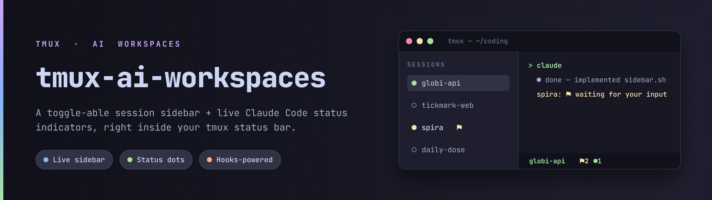
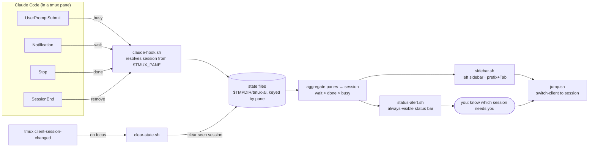

<div align="center">



# tmux-ai-workspaces

**A toggle-able session sidebar + live Claude Code status indicators, right inside tmux.**


</div>

---

> **🚧 Status:** v0.1, in active development. The design is locked (see
> [`docs/superpowers/specs`](docs/superpowers/specs)) and implementation is underway.
> Keybindings and options below describe the target behavior.

## Why

If you run several projects in tmux — each its own session — and you have Claude Code
working in some of them, two things are annoying:

1. **Switching** means `prefix + o` into a fuzzy popup every time; there's no glanceable
   board of what's open.
2. **You can't tell when Claude is done or stuck.** It might be finished, or quietly waiting
   on a permission prompt, and you won't know until you wander back into that session.

`tmux-ai-workspaces` fixes both:

- A **toggle-able left sidebar** that lists your live sessions and lets you jump with one key.
- **Status indicators** — driven by Claude Code hooks — that show, in the always-visible
  status bar, which session is *working*, *done*, or *waiting for your input*.

## Features

- **Left sidebar** (`prefix + Tab`) — a narrow, live pane listing every running session.
  Jump by number; the sidebar **follows you** into the selected session and stays open
  until you close it with `q` (or `prefix + Tab`). Non-invasive: only there when you ask.
- **Status dots** per session: `○` busy · `●` done (green) · `●` + `⚑` waiting (yellow).
- **Always-visible alert** in the status bar (e.g. `⚑2 ●1`) so you know to switch *without*
  opening the sidebar.
- **Auto-clear** — a session's flag clears when you switch into it.
- **Pure shell**, tpm-installable, zero runtime dependencies. Plays nicely with
  catppuccin, resurrect/continuum, and the rest of your config.

## How it works

Claude Code [hooks](https://docs.claude.com/en/docs/claude-code/hooks) write a tiny state
file per pane; the sidebar and the status bar read those files and render indicators.



*(Editable version of this diagram in [FigJam](https://www.figma.com/board/JvASzM8PZjgH4k77ohC2CW).)*

## Requirements

- tmux ≥ 3.2 (uses pane user-options in formats and `split-window -hb`)
- `bash` ≥ 3.2 (the macOS system bash works — no bash 4 required) and `awk`
- [Claude Code](https://docs.claude.com/en/docs/claude-code) (only for the status feature)
- `jq` — optional, used by the hook installer; falls back to a manual snippet if absent

## Install

### With [tpm](https://github.com/tmux-plugins/tpm) (recommended)

Add to `~/.config/tmux/tmux.conf`:

```tmux
set -g @plugin 'LeonardM01/tmux-ai-workspaces'
```

Then hit `prefix + I` to install.

### Manual

```sh
git clone https://github.com/LeonardM01/tmux-ai-workspaces ~/.config/tmux/plugins/tmux-ai-workspaces
echo "run-shell ~/.config/tmux/plugins/tmux-ai-workspaces/ai-workspaces.tmux" >> ~/.config/tmux/tmux.conf
tmux source-file ~/.config/tmux/tmux.conf
```

### Enable the Claude Code status hooks

The sidebar works on its own. To light up the status indicators, register the hooks once:

```sh
~/.config/tmux/plugins/tmux-ai-workspaces/scripts/install-hooks.sh
```

This **appends** to your `~/.claude/settings.json` (backing it up first) — it adds a small
state-writer to the `Stop`, `UserPromptSubmit`, `Notification`, and `SessionEnd` hooks and
leaves any existing hooks untouched. If `jq` isn't installed, it prints a snippet for you to
merge by hand.

## Usage

| Key | Action |
|-----|--------|
| `prefix + Tab` | Toggle the sidebar |
| `1`–`9` (in sidebar) | Jump to that session |
| `q` / `Esc` (in sidebar) | Close the sidebar |

### Status legend

| Indicator | Meaning |
|-----------|---------|
| `○` dim | Claude is **busy** working |
| `●` green | Claude is **done** with its turn |
| `●` yellow + `⚑` | Claude is **waiting** for your input or a permission |

The status bar shows a roll-up of *other* sessions, e.g. `⚑2 ●1` = two waiting, one done.

## Configuration

Set these before the plugin line in `tmux.conf`:

| Option | Default | Description |
|--------|---------|-------------|
| `@ai_sidebar_key` | `Tab` | Toggle key, used as `prefix + <key>` |
| `@ai_sidebar_width` | `24` | Sidebar width in columns |
| `@ai_state_dir` | `$TMPDIR/tmux-ai` | Where per-pane state files live |

```tmux
set -g @ai_sidebar_key 'w'
set -g @ai_sidebar_width '28'
```

## Testing

```sh
scripts/selftest.sh
```

Runs plain-shell assertions over the state logic (urgency ranking, aggregation, pruning)
plus a headless integration smoke test on a private tmux socket — it never touches your
live server.

## Roadmap

See [`FUTURE.md`](FUTURE.md). Highlights: a compiled-TUI sidebar, fzf fuzzy-jump, listing
unopened project dirs (sessionizer-style), a per-window tree view, and desktop/audible
notifications on `wait`.

## Credits

Built for a catppuccin + tpm + resurrect/continuum workflow. Inspired by
[tmux-sessionx](https://github.com/omerxx/tmux-sessionx).

## License

[MIT](LICENSE) © Leonard Martinis
